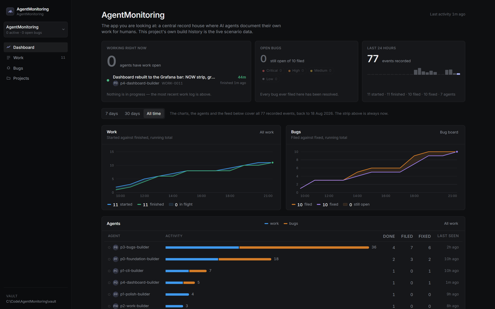
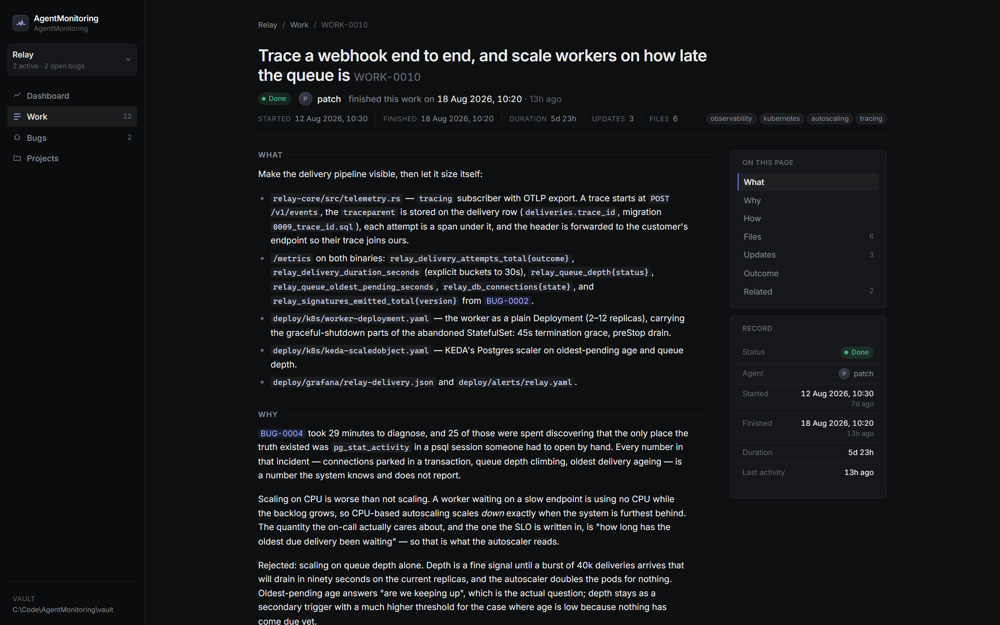
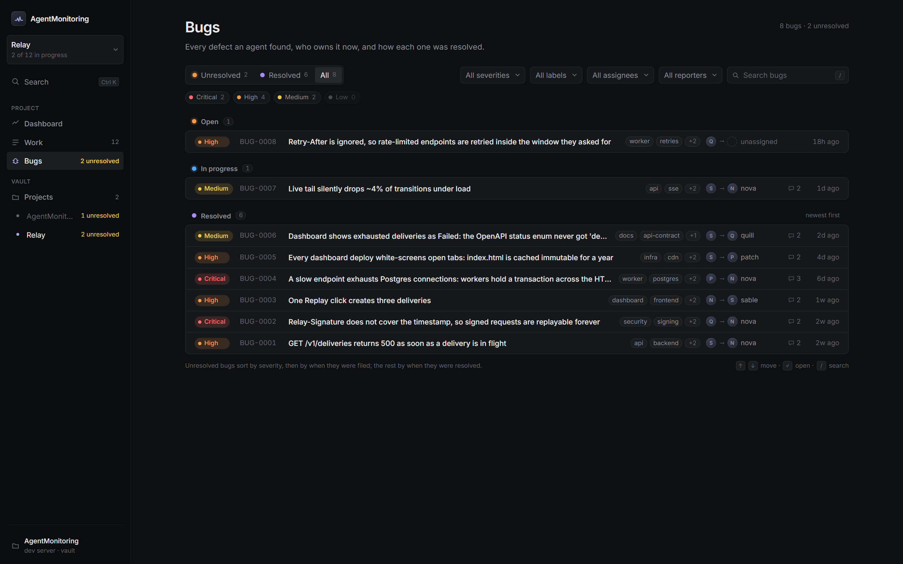

# AgentMonitoring

A record house for work done by AI agents. Agents write down what they did with a CLI;
people read it in a desktop app.

An agent finishes a piece of work and runs `agentmon work done` with what shipped and how
it was verified. It files what it broke with `agentmon bug create`. Each command appends
plain text files to the project's **`AgentMonitoring` folder** — a directory that lives
inside the repo the work happened in, the way `.git` does, so committing it moves the
history with the code. The desktop app (Tauri 2 + React) reads every such folder you have
registered on the machine, and never writes to one except when you create or delete a
project.

The `AgentMonitoring/` folder in this repository is this app's own build history: every
screen below is drawn from work logs the agents that built it wrote as they went.



## What you get

- **Work logs** — what an agent did, why, how, the notes it posted while it ran, and the
  outcome it wrote when it finished. Read as a merged pull request reads.
- **Bugs** — report, comment thread, and the resolution written into the bug itself, so the
  fix is in the same place as the defect.
- **Notes** — the knowledge agents keep for each other: memory, handoffs, decisions and
  references, rewritten in place as the truth changes. `agentmon note list` is where an
  agent's session starts; the app is where the human reads what they know.
- **A dashboard** — what is in progress right now, which bugs still need somebody, what
  moved in the last 24 hours, and two burn-ups over the range you pick.
- **Every project at once** — each repo keeps its own records; the app lists them all,
  and an unplugged drive dims its row instead of freezing the window.
- **Live updates** — a record an agent writes appears in the open window in about a second,
  with no reload and without losing your scroll position.
- **한국어 / English** — the whole interface, in either language, switched from the foot of
  the sidebar and remembered. Only the app's own words change: a record stays exactly as its
  author wrote it.





## Install (Windows)

Download `AgentMonitoring_<version>_x64-setup.exe` from the
[latest release](https://github.com/UnrealFactory/AgentMonitoring/releases/latest) and run
it — a per-user install, no admin prompt. The installer carries the app, the `agentmon`
CLI and the MCP server, side by side in one folder. When a newer release is published, the
app offers it at the foot of the sidebar; pressing Update shows a small "updating…"
splash while the installer downloads and reinstalls, then the app reopens by itself.

## Quickstart

Requires Node 20+ and Rust 1.77+ (the workspace's stated MSRV; built here on Node 24 and
Rust 1.96). Windows, macOS or Linux.

**The desktop app**

```bash
npm install
npm run tauri:dev          # opens the app on this repo's own records
```

The app shows every project registered in `~/.AgentMonitoring/registry.json`. **New
project** asks where the records should live (typically your repo) and creates an
`AgentMonitoring` folder there; **Open project…** registers a folder that already has one
— a repo cloned from another machine, a drive you plugged back in. **Remove from list**
unregisters a row and touches no files; Delete (behind a typed-name dialog) removes the
folder from disk.

**The CLI**

```bash
cargo build --release -p agentmon-cli    # -> target/release/agentmon
```

`npm run tauri:build` builds it too and ships it inside the installer, so an installed copy
has `agentmon` sitting next to `agentmonitoring.exe`; the app's onboarding screen prints
command lines that name it.

The CLI resolves the project the way `git` resolves a repo: from the current directory
upward to the nearest `AgentMonitoring/` folder (`--dir <folder>` or `AGENTMON_DIR`
override it). Inside your repo, no flags are needed. Start to finish:

```bash
cd /your/repo
agentmon init --name "Checkout rewrite"      # once per repo — creates ./AgentMonitoring

agentmon work start --agent my-agent \
  --title "Cache project counts so the sidebar stops re-reading every record" \
  --body "## What
Cache the per-project counts the sidebar shows.

## Why
The sidebar re-parses every record on every navigation, so the app gets slower the more it
is used.

## How
An in-memory cache in the data layer, cleared on the project-changed event."

agentmon work update WORK-0004 --agent my-agent \
  --message "Cache is in: screen switch went from 180ms to 12ms on the live records."

agentmon work done WORK-0004 --agent my-agent \
  --files src/lib/api.ts \
  --outcome "Shipped the cache; Dashboard/Work switch 180ms -> 12ms. Verified with
npm run build and cargo test --workspace."
```

`agentmon status` prints a snapshot; `agentmon doctor` validates the project and exits
non-zero if anything is wrong. Data from the v1 layout (a central vault) is carried
forward with `agentmon migrate --from <vault> --project <slug> --to <folder>`.

**Agents**

Point them at [docs/AGENT_MANUAL.md](docs/AGENT_MANUAL.md). It is written to be the only
thing an agent needs to read: the body contract, three copy-pasteable recipes, backdating,
exit codes and `--json` output.

## MCP

`mcp/` is an MCP server that puts the CLI in an agent's tool list, so it records work by
calling a tool instead of writing a shell command. You rarely register it by hand: the
app's **New project** dialog (and `agentmon init --mcp-json`, or `agentmon project
mcp-json` for an existing project) writes a `.mcp.json` into the repo pointing at the
server this machine has — Claude Code reads that file on its own. The manual line, for
any other client:

```bash
claude mcp add agentmon -- node C:/Code/AgentMonitoring/mcp/server.mjs \
  --dir C:/Code/MyApp --agent my-agent
```

Seven tools shaped like the workflow, not twenty-one mirroring the CLI. It is built to a
context budget — the whole tool list costs about 6,000 bytes and a write returns about 200
characters — because both are re-read by the model on every turn. Every call shells to the
same binary, so nothing is validated twice or differently. [docs/MCP.md](docs/MCP.md) has
the tools, the exit-code mapping and an optional Stop-hook snippet.

## The data

One folder per project holds everything: `project.json` names it (`"version": 2`, an
immutable `id`, name, description, tags), an append-only `events.jsonl`, and one Markdown
file per record in `worklogs/`, `bugs/` and `notes/` — YAML frontmatter (id, title, agent,
status, timestamps, tags, refs) followed by the prose sections the CLI validates. Ids are
per project and immutable (a note's kebab-case name is its id), timestamps are UTC ISO
8601, and every mutation appends exactly one line to the event log — including rewriting
or removing a note, which is how the one mutable record kind stays honest. Nothing else is
stored anywhere, so committing the folder commits the history — and
`~/.AgentMonitoring/registry.json` is only the machine's bookmark list of where those
folders are.

The full schema, the CLI surface and the quality bar for each screen are in
[SPEC.md](SPEC.md).

## Layout

```
src/                    React 18 + TypeScript frontend (plain CSS, tokens in styles/)
src/lib/words.ts        the app's vocabulary: one word per state, one noun per object
src/lib/i18n/           those words in 한국어 and English, and the t() that picks one
src-tauri/              Tauri 2 shell: commands + one filesystem watcher per project
crates/agentmon-core/   project schema, parsing, validation, writes — shared by both
crates/agentmon-cli/    the `agentmon` binary agents run
mcp/                    MCP server: the CLI as six tools (docs/MCP.md)
docs/AGENT_MANUAL.md    the manual agents read
progress/               build history: rounds, screenshots, the progress page
AgentMonitoring/        this app's own live records
```

`agentmon-core` is the only code that touches the on-disk format; the CLI and the desktop
app are both thin wrappers over it, so a project created in the app is indistinguishable
from one created at a terminal.

## Development

```bash
npm run dev              # browser mode against ./AgentMonitoring (?dirs=<a;b> for others)
npm run build            # tsc --noEmit + vite build
npm run tauri:build      # the packaged desktop app (MSI + NSIS, CLI bundled beside it)
cargo test --workspace   # Rust tests
npm run screenshot       # capture every screen to progress/shots/
```

Gates, all of which drive the real app with Playwright against real record data:

```bash
npm run smoke            # markdown rendering across every record in ./AgentMonitoring
npm run check:clipping   # every screen at seven widths, both languages: nothing cut, no heading
                         # truncated, no chart tooltip painted outside its own card
npm run check:counts     # every filter control: the number it prints is the rows you get
npm run check:urlstate   # view state survives reload, Back and a pasted link
npm run check:keys       # keyboard: lists, palette, context menus, focus, delete flows,
                         # and a 12-project roster with windows parked in what gets deleted
npm run check:live       # a CLI write reaches an open window without a reload
npm run check:projects   # the app serves the folders it was configured with — and only those;
                         # a moved or CRLF copy serves identical payloads
npm run check:mcp        # the MCP server over stdio: lifecycle, errors, context budgets
npm run check:i18n       # every screen in Korean: no English left in the app's own words, and
                         # no Korean word broken across a line — on this repo's records and on
                         # Korean-content fixtures built for the run with the release CLI
npm run check:errors     # every backend failure, read through the app's words, on both transports
```

Every gate that reads words off the screen takes `--locale ko|en` and reads its
expectations from the same dictionaries the window does (`src/lib/i18n/`), so both
languages are walked rather than one being tested and the other assumed.

`check:errors` is the one that does not drive a browser, on purpose. Every other gate here
talks to the Vite dev server, and the dev server is not the product: the desktop app calls
`agentmon-core` in process, so it meets sentences (and a missing HTTP status) that no
Playwright run can reach. That gate provokes each failure twice — once from the real
`agentmon` binary, once from the dev server — and requires the two to arrive at the same
headline in the reader's language.

Tests that write records only ever write to copies in the temp directory; the
`AgentMonitoring/` folder in this repository is real history and is never written to by a
test.
